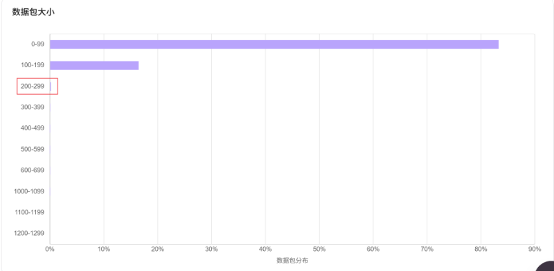
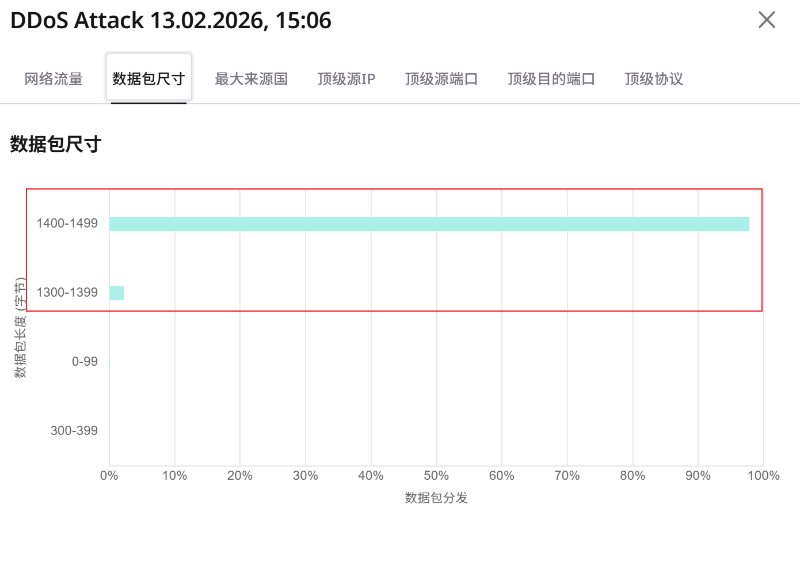

# 数据包大小：正常流量 vs 攻击流量对照

本文整理两份「数据包尺寸 / 数据包大小」分布截图的观测结论，用于理解 **正常业务流量** 与 **体量型攻击流量** 在包长分布上的差异。

> **范围说明：** RelayGate / Envoy 为通用 L4 转发，**非抗 DDoS**（见根 README「已知边界」）。大流量清洗应依赖云高防或上游网络侧能力；本文仅作流量特征对照，不构成产品能力承诺。

## 1. 样本概览

| 维度 | 正常流量 | 被攻击流量 |
|------|----------|------------|
| 观测视图 | 数据包大小分布 | DDoS Attack 监控看板 ·「数据包尺寸」 |
| 主导包长 | **0–99 字节**（约 83%–84%） | **1400–1499 字节**（约 98%） |
| 次要包长 | 100–199 字节（约 16%–17%） | 1300–1399 字节（约 1%–2%） |
| ≥200 字节 | 几乎可忽略 | 小包档位接近 0% |
| 分布形态 | 极度左偏（小包为主） | 极度右偏、近单峰（接近以太网 MTU） |

## 2. 正常流量



### 观测数据（读图）

| 包长区间（字节） | 约占总量 |
|------------------|----------|
| 0–99 | ~83%–84% |
| 100–199 | ~16%–17% |
| 200–299 | 可见但极小（接近噪声） |
| 300 及以上（图中列出至 1200–1299） | 基本为 0% |

### 解读

- **小包主导**符合常见交互/控制面特征：短连接、ACK、心跳、握手与短载荷等会使 **&lt;100 字节** 与 **100–199 字节** 合计接近 100%。
- 分布呈 **长尾极弱**：中大包几乎不出现，说明该样本窗口内业务不以大块数据推送为主（或采样窗口未覆盖大文件/流媒体高峰）。
- 图中对 **200–299** 的标注提示：该档位在正常基线中占比极低；若后续监控中该档或更大档位突然抬升，更宜结合速率、源 IP/端口、协议一并判断，而不是单独用「有一点 200–299」定罪。

## 3. 被攻击流量



样本标题：**DDoS Attack 13.02.2026, 15:06**（看板「数据包尺寸」页）。

### 观测数据（读图）

| 包长区间（字节） | 约占总量 |
|------------------|----------|
| 1400–1499 | ~98% |
| 1300–1399 | ~1%–2% |
| 0–99、300–399 等 | 接近 0% |

### 解读

- **近单峰、贴近以太网有效载荷上限**（常见 MTU 1500，扣除 IP/传输层头后载荷常落在约 1400+ 字节档）是体量型攻击的典型手法：用尽量大的包提高 **bps**，更快占满带宽。
- 与正常样本对比，**小包档位被淹没**：攻击流量在包数占比上几乎全部落在 1300–1499，正常时占主导的 0–199 几乎不可见。
- 结合同看板其他页（来源国、源 IP、源/目的端口、协议）可进一步判断是 UDP flood、反射放大或其他变体；**仅凭包长**即可强提示「非正常业务分布」，但定性攻击类型还需协议与源分布。

## 4. 对照结论

```text
正常：  [████████████████████████████████████████████] 0–99  ~84%
        [████████]                                       100–199 ~16%
        [·]                                              其他 ≈0

攻击：  [·]                                              小包 ≈0
        [█]                                              1300–1399 ~2%
        [██████████████████████████████████████████████] 1400–1499 ~98%
```

| 判别线索 | 正常侧 | 攻击侧 |
|----------|--------|--------|
| 峰值档位 | 小包（&lt;200） | 近 MTU 大包（约 1400–1499） |
| 集中度 | 两档合计 ≈100%，但仍偏「业务小包」 | 单档 ≈98%，高度均一 |
| 业务合理性 | 符合短交互 / 控制包占比高 | 不符合常见混合业务包长多样性 |
| 主要风险面 | — | **带宽打满（bps）**；同时可能抬高 pps，加重边缘与转发路径压力 |

**一句话：** 正常流量「小而散（以小包为主）」；该次攻击流量「大而齐（近满 MTU 单峰）」。包长直方图是快速 triage 的有效信号，应与速率、协议、源多样性交叉验证。

## 5. 运维侧可用动作（边界内）

以下为观测与防护分层建议，**不**暗示由 RelayGate 本身完成清洗：

1. **建立基线**：对关键入口定期看包长分布（或云厂商/探针等价指标），记录正常峰值档位与占比。
2. **告警思路（示例）**：短时内「≥1300 字节占比」从近 0 飙到 &gt;80%，同时入向 bps/pps 异常升高 → 优先按攻击处置，而不是先调业务配置。
3. **处置分层**：体量型攻击优先走 **云高防 / 清洗 / 黑洞 / ACL**；L4 网关侧重健康转发与机群运维，不宜当作抗 DDoS 设备。
4. **勿过度拟合单档**：正常样本中 200–299 极低不代表「该档=攻击」；攻击样本的关键是 **大包单峰 + 体量**，不是某一个中间档位本身。
5. **TCP 长连接场景**：正常小包多在 **已建立会话** 上，勿用 PPS 限速 established。可套用安全策略档位 `tcp-longlived`（放宽 idle/并发与适度新建余量）：

   ```bash
   relaygate profile apply tcp-longlived
   # 或 Panel → 安全策略 → 场景「TCP 长连接」
   ```

   参数说明见 [`packaging/security/README.md`](../packaging/security/README.md)「TCP 长连接场景安全策略」。

## 6. 附图来源

| 文件 | 含义 |
|------|------|
| `docs/assets/packet-size-normal.png` | 正常流量 · 数据包大小 |
| `docs/assets/packet-size-ddos.png` | 攻击流量 · 数据包尺寸（DDoS Attack 看板） |

读图百分比为目视近似值，精确数值以原始监控系统导出为准。
